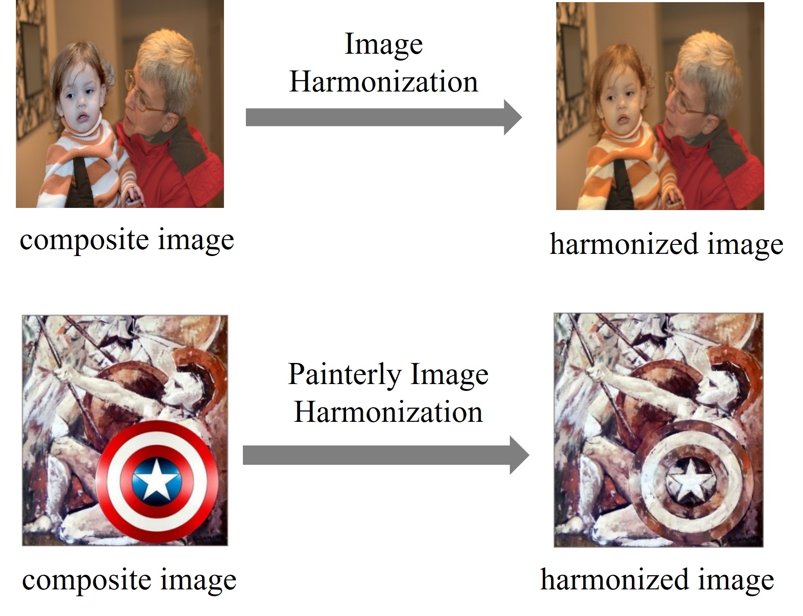

# Awesome Image Harmonization  

A curated list of resources including papers, datasets, and relevant links pertaining to image harmonization. **Image harmonization aims to adjust the color, illumination, and style of foreground to be compatible with the background.** For more complete resources on general image composition, please refer to [Awesome-Image-Composition](https://github.com/bcmi/Awesome-Image-Composition).

  
  

## Contributing

Contributions are welcome.  If you wish to contribute, feel free to send a pull request. If you have suggestions for new sections to be included, please raise an issue and discuss before sending a pull request.

## Table of Contents
+ [Survey](#Survey)
+ [Online Demo](#Online-demo)
+ [Leaderboard](#Leaderboard)
+ [Color Transfer](#Color-transfer)
+ [Papers](#Papers)
+ [Datasets](#Datasets)
+ [Other Resources](#Other-resources)
+ [Related Topics](#Related-topics)

## Survey

A brief review on image harmonization is included in the following survey on image composition:

Li Niu, Wenyan Cong, Liu Liu, Yan Hong, Bo Zhang, Jing Liang, Liqing Zhang: "*Making Images Real Again: A Comprehensive Survey on Deep Image Composition.*" arXiv preprint arXiv:2106.14490 (2021). [[arXiv]](https://arxiv.org/pdf/2106.14490.pdf)

## Online Demo

Try this [online demo](https://bcmi.sjtu.edu.cn/home/niuli/demo_image_composition/) for image harmonization and have fun! 

## Leaderboard

The leaderboard of SOTA image harmonization methods can be found [here](https://github.com/bcmi/Image-Harmonization-Dataset-iHarmony4#experiments).

## Color Transfer 

We summarize different color transfer strategies which could be used for image harmonization task [here](https://github.com/bcmi/Color-Transfer-for-Image-Harmonization). 

## Papers

#### Supervised deep learning methods
+ Zhongyun Hu, Ntumba Elie Nsampi, Xue Wang, Qing Wang: "*SIDNet: Learning Shading-Aware Illumination Descriptor for Image Harmonization.*" IEEE Transactions on Emerging Topics in Computational Intelligence (2024) [[pdf]](https://ieeexplore.ieee.org/stamp/stamp.jsp?tp=&arnumber=10411924)
+ Haoxing Chen, Yaohui Li, Zhangxuan Gu, Zhuoer Xu, Jun Lan, Huaxiong Li: "*Segment Anything Model Meets Image Harmonization.*" ICASSP (2024). [[arXiv]](https://arxiv.org/pdf/2312.12729.pdf)
+ Zhongyun Hu, Jiahao Li, Xue Wang, Qing Wang: "*Spatially-Varying Illumination-Aware Indoor Harmonization.*" arXiv (2024) [[arXiv]](http://www.npu-cvpg.org/uploads/file/24_01_05_02_57_01_603.pdf)
+ Jianqi Chen, Zhengxia Zou, Yilan Zhang, Keyan Chen, Zhenwei Shi: "*Zero-Shot Image Harmonization with Generative Model Prior.*" arXiv preprint arXiv:2307.08182 (2023) [[arXiv]](https://arxiv.org/pdf/2307.08182.pdf) [[code]](https://github.com/WindVChen/Diff-Harmonization)
+ Yijiang Wang, Yuqi Li, Chong Wang, Xulun Ye: "*Harmonized Portrait‐Background Image Composition.*" Computer Graphics Forum (2023) [[paper]](https://onlinelibrary.wiley.com/doi/pdf/10.1111/cgf.14921?casa_token=h0uA-Si6vscAAAAA:VSZjSc7bXDEdD2vUleoW7rtXV5bllIxTFRIepvrbBFlS08h1D2UgQdEGx4qwKRkTeEZ-h3yqJ72nzA)
+ Liuxue Ju, Chengdao Pu, Fang Gao, Jun Yu: "*Adaptive Fine-Grained Region Matching for Image Harmonization.*" ICIG (2023) [[pdf]](https://www.researchgate.net/profile/Jun_Yu42/publication/375067639_Adaptive_Fine-Grained_Region_Matching_for_Image_Harmonization/links/65446de9ce88b87031bad484/Adaptive-Fine-Grained-Region-Matching-for-Image-Harmonization.pdf)
+ Jiajie Li, Jian Wang, Chen Wang, Jinjun Xiong: "*Image Harmonization with Diffusion Model.*" arXiv preprint arXiv:2306.10441 (2023) [[arXiv]](https://arxiv.org/pdf/2306.10441.pdf)
+ Huayan Yu, Hai Huang, Yueyan Zhu, Aoran Chen: "*Semantic‐aware visual consistency network for fused image harmonisation.*" IET Signal Processing (2023) [[paper]](https://ietresearch.onlinelibrary.wiley.com/doi/pdf/10.1049/sil2.12219)
+ Chris Careaga, S. Mahdi H. Miangoleh, Yağız Aksoy: "*Intrinsic Harmonization for Illumination-Aware Compositing.*" SIGGRAPH Asia (2023) [[pdf]](https://dl.acm.org/doi/pdf/10.1145/3610548.3618178?casa_token=A4OfyNhGlrEAAAAA:vvl7zN8Sue4IUjRPwMWfwdHnC1aYUAlDmaFGS1lMTXbjEP39DRq1Oh_uaK_8Rce9SuLIPIjCCCw)
+ Haoxing Chen, Zhangxuan Gu, Yaohui Li, Jun Lan, Changhua Meng, Weiqiang Wang, Huaxiong Li: "*Hierarchical Dynamic Image Harmonization.*" ACM MM (2023) [[arXiv]](https://arxiv.org/pdf/2211.08639.pdf) [[code]](https://github.com/chenhaoxing/HDNet)
+ Linfeng Tan, Jiangtong Li, Li Niu, Liqing Zhang: "*Deep Image Harmonization in Dual Color Spaces.*" ACM MM (2023)   [[arXiv]](https://arxiv.org/pdf/2308.02813.pdf) [[code]](https://github.com/bcmi/DucoNet-Image-Harmonization)
+ Ke Xu, Gerhard Petrus Hancke, Rynson W.H. Lau: "*Learning Image Harmonization in the Linear Color Space.*" ICCV (2023) [[paper]](https://openaccess.thecvf.com/content/ICCV2023/papers/Xu_Learning_Image_Harmonization_in_the_Linear_Color_Space_ICCV_2023_paper.pdf)
+ Xintian Shen, Jiangning Zhang, Jun Chen, Shipeng Bai, Yue Han, Yabiao Wang, Chengjie Wang, Yong Liu: "*Learning Global-aware Kernel for Image Harmonization.*" ICCV (2023) [[arXiv]](https://arxiv.org/pdf/2305.11676.pdf) [[code]](https://github.com/XintianShen/GKNet)
+ Li Niu, Junyan Cao, Wenyan Cong, Liqing Zhang: "*Deep Image Harmonization with Learnable Augmentation.*" ICCV (2023) [[arXiv]](https://arxiv.org/pdf/2308.00376.pdf) [[code]](https://github.com/bcmi/SycoNet-Adaptive-Image-Harmonization)
+ Li Niu, Linfeng Tan, Xinhao Tao, Junyan Cao, Fengjun Guo, Teng Long, Liqing Zhang: "*Deep Image Harmonization with Globally Guided Feature Transformation and Relation Distillation.*" ICCV (2023) [[arXiv]](https://arxiv.org/pdf/2308.00356.pdf) [[dataset]](https://github.com/bcmi/Image-Harmonization-Dataset-ccHarmony)
+ Jianqi Chen, Yilan Zhang, Zhengxia Zou, Keyan Chen, Zhenwei Shi: "*Dense Pixel-to-Pixel Harmonization via Continuous Image Representation.*" T-CSVT (2023)  [[arXiv]](https://arxiv.org/pdf/2303.01681.pdf) [[code]](https://github.com/WindVChen/INR-Harmonization)
+ Ke Wang, Michaël Gharbi, He Zhang, Zhihao Xia, Eli Shechtman: "*Semi-supervised Parametric Real-world Image Harmonization.*" CVPR (2023) [[arXiv]](https://arxiv.org/pdf/2303.00157.pdf) [[code]](https://github.com/adobe/PIH/)
+ Sheng Liu, Cong Phuoc Huynh, Cong Chen, Maxim Arap, Raffay Hamid: "*LEMaRT: Label-Efficient Masked Region Transform for Image Harmonization.*" CVPR (2023) [[pdf]](https://openaccess.thecvf.com/content/CVPR2023/papers/Liu_LEMaRT_Label-Efficient_Masked_Region_Transform_for_Image_Harmonization_CVPR_2023_paper.pdf)
+ Julian Jorge Andrade Guerreiro, Mitsuru Nakazawa, Björn Stenger: "*PCT-Net: Full Resolution Image Harmonization Using Pixel-Wise Color Transformations.*" CVPR (2023) [[pdf]](https://openaccess.thecvf.com/content/CVPR2023/papers/Guerreiro_PCT-Net_Full_Resolution_Image_Harmonization_Using_Pixel-Wise_Color_Transformations_CVPR_2023_paper.pdf) [[supp]](https://openaccess.thecvf.com/content/CVPR2023/supplemental/Guerreiro_PCT-Net_Full_Resolution_CVPR_2023_supplemental.pdf) [[code]](https://github.com/rakutentech/PCT-Net-Image-Harmonization/)
+ Jeya Maria Jose Valanarasu, He Zhang, Jianming Zhang, Yilin Wang, Zhe Lin, Jose Echevarria, Yinglan Ma, Zijun Wei, Kalyan Sunkavalli, Vishal M. Patel: "*Interactive Portrait Harmonization.*" ICLR (2023) [[arXiv]](https://openreview.net/pdf?id=AP0iZoaRaS)
+ Tianyanshi Liu, Yuhang Li, Youdong Ding: "*Image harmonization with spatial feature interaction and back-projection upsample.*" CISAI (2022) [[paper]](https://www.spiedigitallibrary.org/conference-proceedings-of-spie/12566/1256626/Image-harmonization-with-spatial-feature-interaction-and-back-projection-upsample/10.1117/12.2667660.short)
+ Min Lu, Lingtao Zhang, Yongmin Liu: "*Background-lead self-attention for image harmonization.*" JEI (2022) [[paper]](https://www.spiedigitallibrary.org/journals/journal-of-electronic-imaging/volume-31/issue-6/063038/Background-lead-self-attention-for-image-harmonization/10.1117/1.JEI.31.6.063038.short#_=_)
+ Teng Ren, Haitao Zhang: "*Illumination-aware Style Transfer for Image Harmonization.*" ICIP (2022) [[pdf]](https://ieeexplore.ieee.org/stamp/stamp.jsp?arnumber=9897164&casa_token=kZPiS-8RVDoAAAAA:Zuc50TxSneP6JofJDmVZziHQArtQpQNfpW17QShbe_uLvMxjnxbhz9JS-Z43KkMWo7M1QpQg&tag=1)
+ Ziyue Zhu, Zhao Zhang, Zheng Lin, Ruiqi Wu, Chunle Guo: "*Image Harmonization by Matching Regional References.*" arXiv preprint arXiv:2204.04715 (2022) [[arXiv]](https://arxiv.org/pdf/2204.04715.pdf)
+ Xun Cai, Qingjie Shi, Yanbo Gao, Shuai Li, Wei Hua, Tian Xie: "*A Structure-Preserving and Illumination-Consistent Cycle Framework for Image Harmonization.*" T-MM (2022) [[pdf]](https://ieeexplore.ieee.org/abstract/document/10078341)
+ Yazhou Xing, Yu Li, Xintao Wang, Ye Zhu, Qifeng Chen: "*Composite Photograph Harmonization with Complete Background Cues.*" ACM MM (2022) [[pdf]](https://dl.acm.org/doi/abs/10.1145/3503161.3548031)
+ Junyan Cao, Wenyan Cong, Li Niu, Jianfu Zhang, Liqing Zhang: "*Deep Image Harmonization by Bridging the Reality Gap.*" BMVC (2022) [[arXiv]](https://arxiv.org/pdf/2103.17104.pdf) [[dataset]](https://github.com/bcmi/Rendered-Image-Harmonization-Dataset-RHHarmony) (**rendered images**)
+ Zonghui Guo, Zhaorui Gu, Bing Zheng, Junyu Dong, Haiyong Zheng: "*Transformer for Image Harmonization and Beyond.*" T-PAMI (2022) [[pdf]](https://ieeexplore.ieee.org/abstract/document/9893399)
+ Ben Xue, Shenghui Ran, Quan Chen, Rongfei Jia, Binqiang Zhao, Xing Tang: "*DCCF: Deep Comprehensible Color Filter Learning Framework for High-Resolution Image Harmonization.*" ECCV (2022) [[arXiv]](https://arxiv.org/pdf/2207.04788.pdf) [[code]](https://github.com/rockeyben/DCCF)
+ Jingtang Liang, Xiaodong Cun, and Chi-Man Pun: "*Spatial-Separated Curve Rendering Network for Efficient and High-Resolution Image Harmonization.*" ECCV (2022)  [[arXiv]](https://arxiv.org/pdf/2109.05750.pdf) [[code]](https://github.com/stefanLeong/S2CRNet) 
+ Xuqian Ren, Yifan Liu: "*Semantic-guided Multi-Mask Image Harmonization.*" ECCV (2022) [[arXiv]](https://arxiv.org/pdf/2207.11722.pdf) [[code]](https://github.com/XuqianRen/Semantic-guided-Multi-mask-Image-Harmonization)
+ Zhanghan Ke, Chunyi Sun, Lei Zhu, Ke Xu, Rynson W.H. Lau: "*Harmonizer: Learning to Perform White-Box Image and Video Harmonization.*" ECCV (2022) [[arXiv]](https://arxiv.org/pdf/2207.01322.pdf) [[code]](https://github.com/ZHKKKe/Harmonizer)
+ Wenyan Cong, Xinhao Tao, Li Niu, Jing Liang, Xuesong Gao, Qihao Sun, Liqing Zhang: "*High-Resolution Image Harmonization via Collaborative Dual Transformations.*" CVPR (2022) [[arXiv]](https://arxiv.org/pdf/2109.06671.pdf) [[dataset]](https://github.com/bcmi/CDTNet-High-Resolution-Image-Harmonization) 
+ Zhongyun Bao, Chengjiang Long, Gang Fu, Daquan Liu, Yuanzhen Li, Jiaming Wu, Chunxia Xiao: "*Deep Image-based Illumination Harmonization.*" CVPR (2022) [[arXiv]](https://arxiv.org/pdf/2108.00150.pdf) (**rendered images**)
+ Yucheng Hang, Bin Xia, Wenming Yang, Qingmin Liao: "*SCS-Co: Self-Consistent Style Contrastive Learning for Image Harmonization.*" CVPR (2022) [[arXiv]](https://arxiv.org/pdf/2204.13962.pdf) [[code]](https://github.com/YCHang686/SCS-Co-CVPR2022)
+ Zonghui Guo, Dongsheng Guo, Haiyong Zheng, Zhaorui Gu, Bing Zheng, Junyu Dong: "*Image Harmonization with Transformer.*" ICCV (2021) [[pdf]](https://openaccess.thecvf.com/content/ICCV2021/papers/Guo_Image_Harmonization_With_Transformer_ICCV_2021_paper.pdf) [[supp]](https://openaccess.thecvf.com/content/ICCV2021/supplemental/Guo_Image_Harmonization_With_ICCV_2021_supplemental.pdf) [[code]](https://github.com/zhenglab/HarmonyTransformer)
+ Yifan Jiang, He Zhang, Jianming Zhang, Yilin Wang, Zhe Lin, Kalyan Sunkavalli, Simon Chen, Sohrab Amirghodsi, Sarah Kong, Zhangyang Wang: "*SSH: A Self-Supervised Framework for Image Harmonization.*" ICCV (2021) [[pdf]](https://openaccess.thecvf.com/content/ICCV2021/papers/Jiang_SSH_A_Self-Supervised_Framework_for_Image_Harmonization_ICCV_2021_paper.pdf) [[supp]](https://openaccess.thecvf.com/content/ICCV2021/supplemental/Jiang_SSH_A_Self-Supervised_ICCV_2021_supplemental.pdf) [[arXiv]](https://arxiv.org/pdf/2108.06805.pdf) [[code]](https://github.com/VITA-Group/SSHarmonization)
+ Jun Ling, Han Xue, Li Song, Rong Xie, Xiao Gu: "*Region-Aware Adaptive Instance Normalization for Image Harmonization.*" CVPR (2021) [[pdf]](https://openaccess.thecvf.com/content/CVPR2021/papers/Ling_Region-Aware_Adaptive_Instance_Normalization_for_Image_Harmonization_CVPR_2021_paper.pdf) [[supp]](https://openaccess.thecvf.com/content/CVPR2021/supplemental/Ling_Region-Aware_Adaptive_Instance_CVPR_2021_supplemental.pdf) [[arXiv]](http://arxiv.org/abs/2106.02853) [[code]](https://github.com/junleen/RainNet)
+ Zonghui Guo, Haiyong Zheng, Yufeng Jiang, Zhaorui Gu, Bing Zheng: "*Intrinsic Image Harmonization.*" CVPR (2021) [[pdf]](https://openaccess.thecvf.com/content/CVPR2021/papers/Guo_Intrinsic_Image_Harmonization_CVPR_2021_paper.pdf) [[supp]](https://openaccess.thecvf.com/content/CVPR2021/supplemental/Guo_Intrinsic_Image_Harmonization_CVPR_2021_supplemental.pdf) [[code]](https://github.com/zhenglab/IntrinsicHarmony)
+ Wenyan Cong, Li Niu, Jianfu Zhang,  Jing Liang, Liqing Zhang: "*BargainNet: Background-Guided Domain Translation for Image Harmonization.*" ICME (2021) [[arXiv]](https://arxiv.org/abs/2009.09169) [[code]](https://github.com/bcmi/BargainNet)
+ Konstantin Sofiiuk, Polina Popenova, Anton Konushin: "*Foreground-aware Semantic Representations for Image Harmonization.*" WACV (2021) [[pdf]](https://openaccess.thecvf.com/content/WACV2021/papers/Sofiiuk_Foreground-Aware_Semantic_Representations_for_Image_Harmonization_WACV_2021_paper.pdf) [[supp]](https://openaccess.thecvf.com/content/WACV2021/supplemental/Sofiiuk_Foreground-Aware_Semantic_Representations_WACV_2021_supplemental.zip)  [[arXiv]](https://arxiv.org/abs/2006.00809) [[code]](https://github.com/saic-vul/image_harmonization)
+ Guoqing Hao, Satoshi Iizuka, Kazuhiro Fukui: "*Image Harmonization with Attention-based Deep Feature Modulation*." BMVC (2020) [[pdf]](https://www.bmvc2020-conference.com/assets/papers/0121.pdf) [[supp]](https://www.bmvc2020-conference.com/assets/supp/0121_supp.zip) [[code]](https://github.com/Dominoer/bmvc2020_image_harmonization)
+ Wenyan Cong, Jianfu Zhang, Li Niu, Liu Liu, Zhixin Ling, Weiyuan Li, Liqing Zhang: "*DoveNet: Deep Image Harmonization via Domain Verification.*" CVPR (2020) [[pdf]](https://openaccess.thecvf.com/content_CVPR_2020/papers/Cong_DoveNet_Deep_Image_Harmonization_via_Domain_Verification_CVPR_2020_paper.pdf) [[supp]](https://openaccess.thecvf.com/content_CVPR_2020/supplemental/Cong_DoveNet_Deep_Image_CVPR_2020_supplemental.pdf) [[arXiv]](https://arxiv.org/abs/1911.13239) [[code]](https://github.com/bcmi/Image_Harmonization_Datasets/tree/master/DoveNet).
+ Xiaodong Cun, Chi-Man Pun: "*Improving the Harmony of the Composite Image by Spatial-Separated Attention Module.*" T-IP (2020) [[pdf]](https://ieeexplore.ieee.org/stamp/stamp.jsp?tp=&arnumber=9018370) [[arXiv]](https://arxiv.org/abs/1907.06406) [[code]](https://github.com/vinthony/s2am)
+ Yi-Hsuan Tsai, Xiaohui Shen, Zhe Lin, Kalyan Sunkavalli, Xin Lu, Ming-Hsuan Yang: "*Deep Image Harmonization.*" CVPR (2017) [[pdf]](http://openaccess.thecvf.com/content_cvpr_2017/papers/Tsai_Deep_Image_Harmonization_CVPR_2017_paper.pdf) [[supp]](http://vllab.ucmerced.edu/ytsai/CVPR17/cvpr17_harmonization_supp.pdf) [[arXiv]](https://arxiv.org/abs/1703.00069) [[code]](https://github.com/wasidennis/DeepHarmonization)

#### Unsupervised deep learning methods
+ Anand Bhattad, David A. Forsyth: "*Cut-and-Paste Neural Rendering.*" arXiv preprint arXiv: 2010.05907 (2020) [[arXiv]](https://arxiv.org/abs/2010.05907) [[supp]](https://anandbhattad.github.io/projects/reshading/supp.pdf)
+ Fangneng Zhan, Shijian Lu, Changgong Zhang, Feiying Ma, Xuansong Xie:"*Adversarial Image Composition with Auxiliary Illumination.*"  ACCV (2020) [[pdf]](https://openaccess.thecvf.com/content/ACCV2020/papers/Zhan_Adversarial_Image_Composition_with_Auxiliary_Illumination_ACCV_2020_paper.pdf) [[arXiv]](https://arxiv.org/abs/2009.08255)
+ Bor-Chun Chen, Andrew Kae: "*Toward Realistic Image Compositing With Adversarial Learning.*" CVPR (2019) [[pdf]](http://openaccess.thecvf.com/content_CVPR_2019/papers/Chen_Toward_Realistic_Image_Compositing_With_Adversarial_Learning_CVPR_2019_paper.pdf)
+ Jun-Yan Zhu, Philipp Krähenbühl, Eli Shechtman, Alexei A. Efros:  "*Learning a Discriminative Model for the Perception of Realism in Composite Images.*" ICCV (2015) [[pdf]](https://www.cv-foundation.org/openaccess/content_iccv_2015/papers/Zhu_Learning_a_Discriminative_ICCV_2015_paper.pdf) [[arXiv]](https://arxiv.org/abs/1510.00477) [[code]](https://github.com/junyanz/RealismCNN)

#### Traditional methods
+ Shuangbing Song, Fan Zhong, Xueying Qin, Changhe Tu: "*Illumination Harmonization with Gray Mean Scale.*" Advances in Computer Graphics. CGI (2020) [[pdf]](https://link.springer.com/content/pdf/10.1007%2F978-3-030-61864-3_17.pdf)
+ Su Xue, Aseem Agarwala, Julie Dorsey, Holly E. Rushmeier:
"*Understanding and improving the realism of image composites.*" ACM Trans. Graph. 31(4): 84:1-84:10 (2012) [[pdf]](https://graphics.cs.yale.edu/sites/default/files/2012sig_compositing.pdf)
+ Kalyan Sunkavalli, Micah K. Johnson, Wojciech Matusik, Hanspeter Pfister: "*Multi-scale image harmonization.*" ACM Trans. Graph. 29, 4 (2010) [[pdf]](http://www.kalyans.org/research/2012/Harmonization_SIG10.pdf)
+ Jean-François Lalonde, Alexei A. Efros: "*Using Color Compatibility for Assessing Image Realism.*" ICCV (2007) [[pdf]](https://ieeexplore.ieee.org/document/4409107) [[code]](https://github.com/jflalonde/colorRealism)

## Datasets
+ **iHarmony4**: It contains four subdatasets: HCOCO, HAdobe5k,	HFlickr, Hday2night, with a total of 73,146 pairs of unharmonized images and harmonized images. [[pdf]](https://openaccess.thecvf.com/content_CVPR_2020/papers/Cong_DoveNet_Deep_Image_Harmonization_via_Domain_Verification_CVPR_2020_paper.pdf) [[link]](https://github.com/bcmi/Image_Harmonization_Datasets)
+ **GMSDataset**: It contains 183 images with image resolution of 1940*1440. It consists of 16 different objects and for each object, one source image and 11 target images in different background scenes and illumination conditions are captured. [[pdf]](https://link.springer.com/content/pdf/10.1007%2F978-3-030-61864-3_17.pdf) [[link]](https://pan.baidu.com/s/141bLd3kjw8I4L7vUhYiEnQ) (access code: ekn2)
+ **HVIDIT**: A dataset built upon VIDIT (Virtual Image Dataset for Illumination Transfer) dataset for image harmonization. It contains 3007 images of 276 scenes for training and 329 images of 24 scenes for testing. [[pdf]](https://openaccess.thecvf.com/content/CVPR2021/papers/Guo_Intrinsic_Image_Harmonization_CVPR_2021_paper.pdf) [[link]](https://github.com/zhenglab/IntrinsicHarmony)
+ **RdHarmony**: A rendered image harmonization dataset, which contains 25,000 ground-truth rendered images with 11 novel categories, and has the potential to generate 225,000 composite rendered images. [[pdf]](https://arxiv.org/pdf/2103.17104.pdf) [[link]](https://github.com/bcmi/Rendered_Image_Harmonization_Datasets)
+ **RealHM**: A Real-world HarMonization dataset, which contains 216 real composite images with manually harmonized outputs. [[pdf]](https://arxiv.org/pdf/2108.06805.pdf) [[link]](https://github.com/VITA-Group/SSHarmonization)
+ **ccHarmony**: An image harmonization dataset constructed based on the images captured with color checker (cc). It contains 10 synthetic composite images for each of 426 foregrounds from 350 real images, leading to 4260 pairs of synthetic composite images and ground-truth real images. [[pdf]](https://arxiv.org/pdf/2206.00800.pdf) [[link]](https://github.com/bcmi/Image-Harmonization-Dataset-ccHarmony)

## Related Topics

#### Painterly/Style image harmonization

+ Li Niu, Junyan Cao, Yan Hong, Liqing Zhang: "*Painterly Image Harmonization by Learning from Painterly Objects.*" AAAI (2024) [[arXiv]](https://arxiv.org/pdf/2312.10263.pdf) [[code]](https://github.com/bcmi/ArtoPIH-Painterly-Image-Harmonization)
+ Li Niu, Yan Hong, Junyan Cao, Liqing Zhang: "*Progressive Painterly Image Harmonization from Low-level Styles to High-level Styles.*" AAAI (2024) [[arXiv]](https://arxiv.org/pdf/2312.10264.pdf) [[code]](https://github.com/bcmi/ProPIH-Painterly-Image-Harmonization)
+ Xudong Wang, Li Niu, Junyan Cao, Yan Hong, Liqing Zhang: "*Painterly Image Harmonization via Adversarial Residual Learning.*" WACV (2024) [[pdf]](https://openaccess.thecvf.com/content/WACV2024/papers/Wang_Painterly_Image_Harmonization_via_Adversarial_Residual_Learning_WACV_2024_paper.pdf)
+ Ruibin Li, Jingcai Guo, Song Guo, Qihua Zhou, Jie Zhang: "FreePIH: Training-Free Painterly Image Harmonization with Diffusion Model." arXiv preprint arXiv:2311.14926 (2023) [[arXiv]](https://arxiv.org/pdf/2311.14926.pdf)
+ Xiao Zhang, Yun Jiang, Shanshan Wang: "*Adaptive Convolution Kernel for Painterly Image Harmonization.*" ICIDIT (2023) [[arXiv]](https://www.atlantis-press.com/article/125992858.pdf)
+ Sungho Kang , Hyunkyu Park, YeongHyeon Park, Yeonho Lee , Hanbyul Lee, Seho Bae, Juneho Yi: "*Exploiting Monocular Depth Estimation for Style Harmonization in Landscape Painting.*" ICKII (2023) [[pdf]](https://ieeexplore.ieee.org/stamp/stamp.jsp?arnumber=10332789&casa_token=dvMSvpjcY2IAAAAA:nNBqSi_l1XB_wKqdFQDA8en5_q1c2nC8mnxWBxpq0mA1uhGthFFMOUHV0Ce4cKmOa0vDrcQK&tag=1)
+ Juwon Lee, Jung-Jae Yu, Wonyoung Yoo: "*An Interactive System for Painterly Image Harmonization.*" ICTC (2023) [[paper]](https://ieeexplore.ieee.org/stamp/stamp.jsp?arnumber=10392517&casa_token=xxhQ_zyZxJYAAAAA:F_8R5AtK_N2aEgPwb161ohlBhmpSdqXhJ6sOl4kjOJ0-ia6GYC4sHeLAyak60wOYpiOb5En8)
+ Lingxiao Lu, Jiangtong Li, Junyan Cao, Li Niu, Liqing Zhang: "*Painterly Image Harmonization using Diffusion Model.*" ACM MM (2023) [[arXiv]](https://arxiv.org/pdf/2308.02228.pdf) [[code]](https://github.com/bcmi/PHDiffusion-Painterly-Image-Harmonization) 
+ Junyan Cao, Yan Hong, Li Niu: "*Painterly Image Harmonization in Dual Domains.*" AAAI (2023) [[arXiv]](https://arxiv.org/pdf/2212.08846.pdf) [[code]](https://github.com/bcmi/PHDNet-Painterly-Image-Harmonization)
+ Xiao Yan, Yang Lu, Juncheng Shuai, Sanyuan Zhang: "*Style Image Harmonization via Global-Local Style Mutual Guided.*" ACCV (2022) [[paper]](https://openaccess.thecvf.com/content/ACCV2022/papers/Yan_Style_Image_Harmonization_via_Global-Local_Style_Mutual_Guided_ACCV_2022_paper.pdf)
+ Hwai-Jin Peng, Chia-Ming Wang, Yu-Chiang Frank Wang: "*Element-Embedded Style Transfer Networks for Style Harmonization.*" BMVC (2019) [[paper]](https://bcmi.sjtu.edu.cn/~niuli/paper/Element-Embedded_Style_Transfer_Networks.pdf)
+ Fujun Luan, Sylvain Paris, Eli Shechtman, Kavita Bala: "*Deep Painterly Harmonization.*"  Computer graphics forum (2018) [[arXiv]](https://arxiv.org/pdf/1804.03189.pdf?ref=https://githubhelp.com) [[code]](https://github.com/luanfujun/deep-painterly-harmonization)

#### Inharmonious region localization
+ Shu Zhang, Hai Huang, Yueyan Zhu: "*Multi-Scale Context Aggregation Network for Inharmonious Region Localization.*" ICAIT (2023) [[pdf]](https://ieeexplore.ieee.org/stamp/stamp.jsp?arnumber=10367321&casa_token=dpf1H1uuD1kAAAAA:eJW-r0z2mHbJafBeHcpXZtywXWA2LZPDgepA5yoFbnPYqG5bCmWj-94Q_McxX3wdyfVLc09D&tag=1)
+ Penghao Wu, Li Niu, Liqing Zhang: "*Inharmonious Region Localization with Auxiliary Style Feature.*" BMVC (2022) [[pdf]](https://bmvc2022.mpi-inf.mpg.de/0197.pdf) [[code]](https://github.com/bcmi/AustNet-Inharmonious-Region-Localization)
+ Jing Liang, Li Niu, Penghao Wu, Fengjun Guo, Teng Long: "*Inharmonious Region Localization by Magnifying Domain Discrepancy.*" AAAI (2022) [[arXiv]](https://arxiv.org/pdf/2209.15368.pdf) [[code]](https://github.com/bcmi/MadisNet-Inharmonious-Region-Localization)
+ Jing Liang, Li Niu, Liqing Zhang: "*Inharmonious Region Localization.*" ICME (2021) [[arXiv]](https://arxiv.org/abs/2104.09453) [[code]](https://github.com/bcmi/DIRL) 

#### Video harmonization
+ Xiuwen Chen, Li Fang, Long Ye, Qin Zhang: "*Deep Video Harmonization by Improving Spatial-temporal Consistency.*" Machine Intelligence Research (2024) [[pdf]](https://link.springer.com/article/10.1007/s11633-023-1447-3)
+ Zeyu Xiao, Yurui Zhu, Xueyang Fu, Zhiwei Xiong: "*TSA2: Temporal Segment Adaptation and Aggregation for Video Harmonization.*" WACV (2024) [[pdf]](https://openaccess.thecvf.com/content/WACV2024/papers/Xiao_TSA2_Temporal_Segment_Adaptation_and_Aggregation_for_Video_Harmonization_WACV_2024_paper.pdf)
+ Xinyuan Lu, Shengyuan Huang, Li Niu, Wenyan Cong, Liqing Zhang: "*Deep Video Harmonization with Color Mapping Consistency.*" IJCAI (2022) [[arXiv]](https://arxiv.org/pdf/2205.00687.pdf) [[dataset&code]](https://github.com/bcmi/Video-Harmonization-Dataset-HYouTube)
+ Haozhi Huang, Senzhe Xu, Junxiong Cai, Wei Liu, Shimin Hu: "*Temporally Coherent Video Harmonization Using Adversarial Networks.*" IEEE Trans. Image Process. 29: 214-224 (2020) [[pdf]](https://ieeexplore.ieee.org/stamp/stamp.jsp?tp=&arnumber=8765343) [[arXiv]](https://arxiv.org/abs/1809.01372) 
 
## Other Resources

+ [Awesome-ImageHarmonization](https://github.com/subeeshvasu/Awesome-ImageHarmonization)
+ [Awesome-Image-Composition](https://github.com/bcmi/Awesome-Image-Composition)

